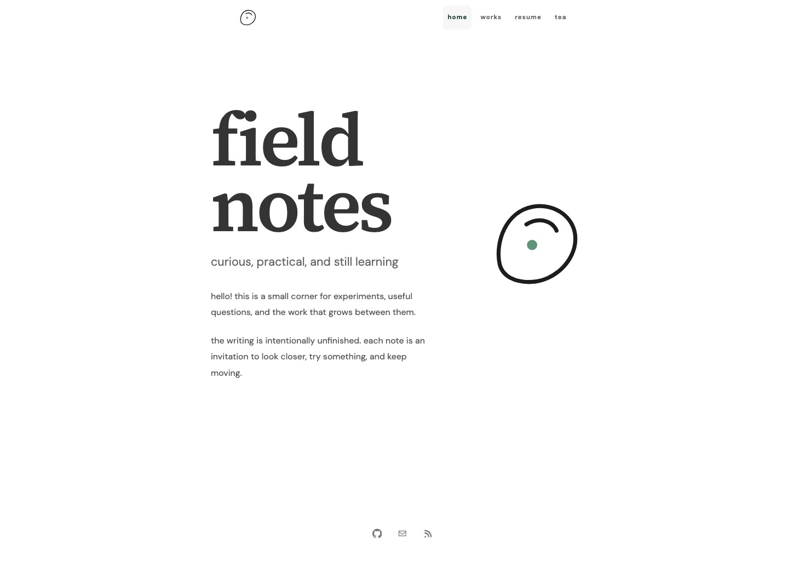
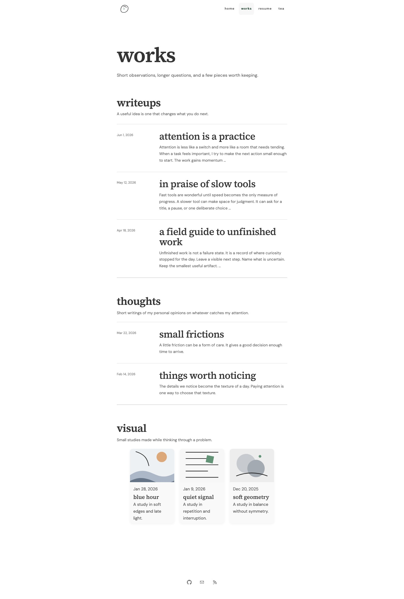
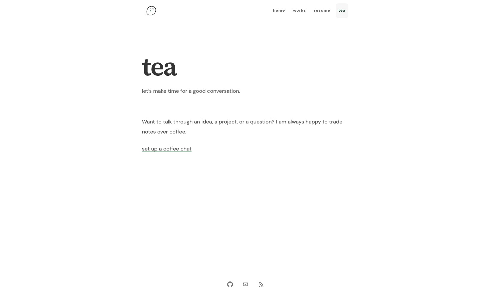

# Artisanal

Artisanal is a Hugo theme for personal sites, portfolios, journals, and resumes.
It uses local fonts, responsive layouts, accessible controls, and small motion details.

## Preview

### Homepage



### Works archive



### Tea page



## Install

Use Hugo 0.158.0 or newer.
The theme does not need a network connection, Sass, Tailwind, or a JavaScript runtime to build a site.

Create a Hugo site and place this repository in its `themes/artisanal` directory.

```sh
hugo new site my-site
cp -R /path/to/artisanal my-site/themes/artisanal
cd my-site
```

Set the theme in `hugo.toml`.

```toml
theme = "artisanal"
```

Copy the files in `exampleSite/content` and the relevant settings in `exampleSite/hugo.toml` to start with the included structure.
Run `hugo server` and open the local address shown by Hugo.

## Features

- A homepage with a configurable title, subtitle, portrait, and header mark.
- Journal sections with list or gallery views.
- Nested backlinks that preserve the visitor’s entry section.
- Resume, taxonomy, RSS, 404, and standard page layouts.
- Local Source Serif 4 display and DM Sans body fonts, with Fraunces available for optional overrides.
- Responsive images with eager loading for lead images and lazy loading for later images.
- Same-origin navigation prefetching on pointer or keyboard intent.
- A slow opacity-only page transition when the browser supports View Transitions.
- Reduced-motion support, skip navigation, focus styles, and Axe accessibility checks.

## Configure

Set optional values under `params.artisanal`.

```toml
[params.artisanal]
accent = "#5c9574"
accentText = "#245c40"
dateFormat = "Jan 2, 2006"
headerMark = "mark.svg"
titleSeparator = "·"
```

The `headerMark` value points to a resource in the homepage page bundle.
Animated image formats such as GIF are supported.
Use `menus.main` for primary navigation and `artisanal.social` for footer icon links.

## Content

Use `type: journal` for archive sections.
Set `artisanal.view` to `list` or `gallery` on a section.
Use `layout: resume` for resume content.
Keep images in page bundles and provide meaningful alternative text.

## Develop and validate

```sh
npm install
npx playwright install chromium webkit
npm test
make serve
```

`npm test` runs the strict Hugo build, HTML validation, browser tests, and accessibility checks.
Override templates by placing a file at the same path in your site’s `layouts` directory.

## License

Theme code is available under the MIT License.
Bundled fonts use the SIL Open Font License 1.1.
See [THIRD_PARTY_NOTICES.md](THIRD_PARTY_NOTICES.md) for attribution.
